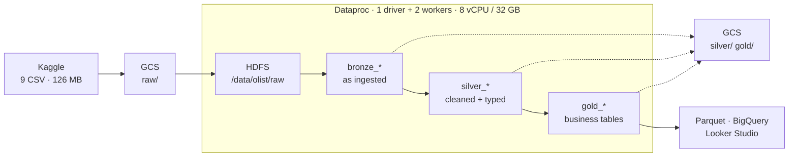
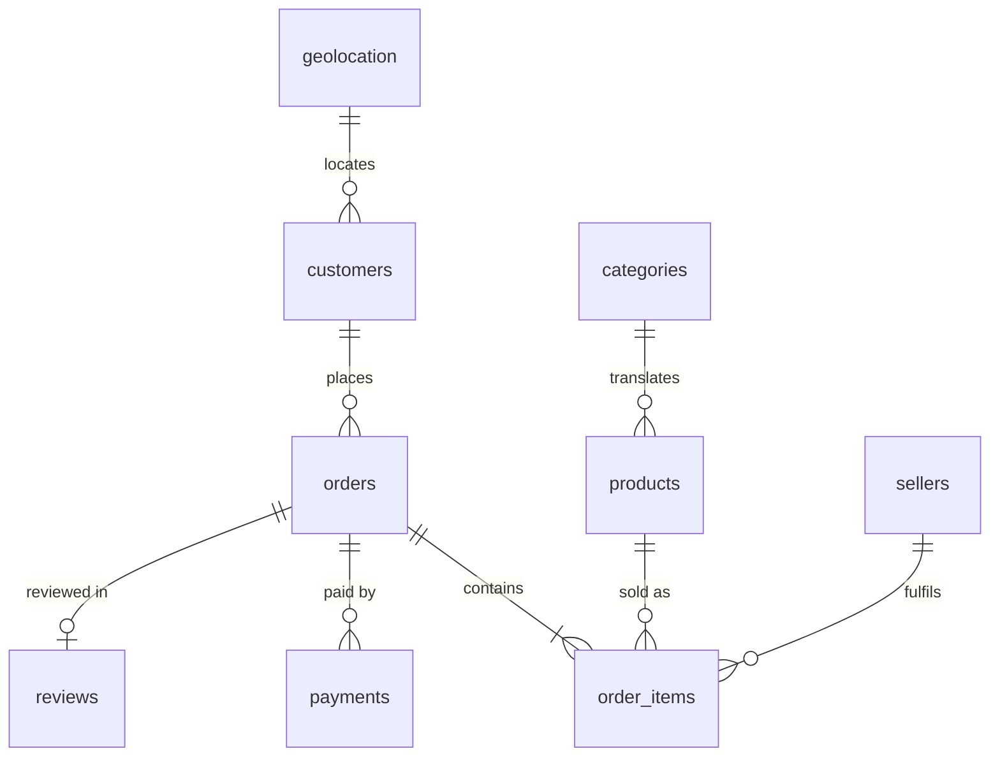

# Olist E-commerce Data Pipeline

Batch pipeline over the [Olist Brazilian e-commerce dataset](https://www.kaggle.com/datasets/olistbr/brazilian-ecommerce) — 9 related CSVs, ~1.4M rows — built with PySpark on a Google Cloud Dataproc cluster using a bronze / silver / gold layout on HDFS and Hive.

> **Status: in progress.** Ingestion, exploration and cleaning are done. Integration, optimization and the serving layer are next — see [Progress](#progress).

## Architecture



Solid arrows are the processing path; dotted arrows are the durable copies. Every layer is written to Cloud Storage as well as HDFS, which makes the cluster disposable — it can be deleted and recreated from `infra/create_cluster.sh` in about three minutes without losing work.

## The data



`orders` is the hub and `order_items` sets the grain — one row per product per order, which is why it carries more rows than `orders` does. Column-level detail, including every derived field and the reasoning behind it, is in [`docs/data_dictionary.md`](docs/data_dictionary.md).

## Pipeline stages

| Notebook | Reads | Does | Writes |
|---|---|---|---|
| `01_ingestion` | CSV on HDFS | Loads 9 datasets, asserts row counts against the source | `bronze_*` |
| `02_exploration` | `bronze_*` | Null and duplicate profiling, business EDA, delivery-time analysis | nothing |
| `03_cleaning` | `bronze_*` | Null handling, type fixes, outlier trimming, geolocation collapse, feature engineering | `silver_*` |
| `04_integration` | `silver_*` | Joins all 8 datasets, aggregations, window functions, enrichment | `gold_*` |
| `05_optimization_serving` | `gold_*` | Executor tuning, join-strategy benchmarks, bucketing, export | Parquet / GCS |

## Data quality findings

The checks in notebooks 01 and 02 caught three problems that produce **wrong numbers without raising an error** — the dangerous kind.

**`order_reviews` parsed 4,938 rows too many.** Spark read 104,162 rows against a documented 99,224. Review comments are free text containing newlines inside quoted fields, so the default CSV reader split single reviews across multiple rows. Left alone, every seller's average review score would have been wrong downstream. Fixed with `multiLine` and `escape`, and notebook 01 now asserts row counts against expected values so the pipeline stops rather than propagating bad data.

**`geolocation` is one-to-many with orders.** The table has 1,000,163 rows but only ~19,000 distinct zip prefixes. Joining it directly multiplies the fact table and inflates every revenue figure. Collapsed to one row per zip — averaging coordinates, taking the first city and state — before any join: **1,000,163 → 19,015**.

**The outlier filter was removing nothing.** `approxQuantile("price", [0.01, 0.99], 0.01)` returned bounds wide enough to span the entire range, because the third argument is a *relative error on the rank* — set to 0.01, it permits the 0.99 quantile to come back as the maximum. Row count after filtering was identical to before. Tightened to 0.001.

## Key decisions

**Dataproc image pinned to 2.2, not the 2.3 default.** Image 2.3 auto-loads a BigLake catalog extension that intercepts every catalog operation and fails unless the Lakehouse API is enabled. It cannot be turned off from the notebook — setting `spark.sql.extensions` on `SparkSession.builder` has no effect because the extension binds at cluster level.

**Fixed 2 workers rather than autoscaling.** Notebook 05 measures join strategies against each other; a cluster that resizes mid-run makes those numbers meaningless. Dataproc's secondary workers are also preemptible by default and can vanish during a job.

**Join type chosen per table from business rules, not convenience.** Orders → items → products → sellers → customers are inner joins: an order missing any of those is unusable. Geolocation, reviews and payments are left joins, because most customers never leave a review and dropping those orders would silently shrink the dataset.

**`median` over `mean` for imputing payment values.** Payment amounts have a long right tail; the mean sits well above anything a typical customer pays.

**Every layer mirrored to Cloud Storage.** HDFS lives on the cluster's disks and dies with it. Writing each layer to `gs://` as well means the cluster can be stopped or deleted between sessions — which is what keeps the bill near zero.

## Reproducing

```bash
# 1. one-time project setup, then create the cluster
bash infra/create_cluster.sh

# 2. download archive.zip from Kaggle, upload it to the bucket through the
#    Cloud Storage console, then from an SSH session on the master:
bash infra/load_data.sh

# 3. open JupyterLab from the cluster's Web Interfaces tab and run
#    notebooks 01 through 05 in order
```

Each notebook is self-contained: it builds its own `SparkSession` and reads its inputs from Hive, so any stage can be re-run on its own as long as the previous layer exists. Nothing is passed between notebooks in memory.

Run one notebook at a time — the cluster has 8 vCPU total, and a second live `SparkSession` will sit waiting for resources that the first one holds.

## Cost

About **$0.46/hour** while running, on a $300 free-trial credit. The cluster is set to stop (not delete) after 2 hours idle; stopped, it costs roughly $0.32/day for the disks. Total spend for the project is expected to stay under $15.

## Layout

```
infra/
  create_cluster.sh     cluster spec with the reasoning behind each flag
  load_data.sh          Kaggle archive -> HDFS + GCS
notebooks/
  01_ingestion.ipynb
  02_exploration.ipynb
  03_cleaning.ipynb
docs/
  data_dictionary.md    every table and column, including derived fields
```

## Stack

PySpark 3.5 · Hadoop 3.3 (HDFS, YARN) · Hive metastore · Parquet · Google Cloud Dataproc, Cloud Storage

## Progress

- [x] Cluster provisioning as a reproducible script
- [x] Kaggle archive into HDFS with replication, mirrored to GCS
- [x] Ingestion of all 9 datasets with row-count assertions
- [x] Null and duplicate profiling, business EDA, delivery-time distribution
- [x] Cleaning: nulls, types, outliers, geolocation collapse, feature engineering
- [ ] Integration: 8-way join, aggregations, window functions, enrichment
- [ ] Optimization: executor tuning, join benchmarks, bucketing
- [ ] Serving: partitioned Parquet, BigQuery load, Looker Studio dashboard
- [x] Docs: data dictionary and ERD
- [ ] Docs: benchmark results, dashboard screenshot
