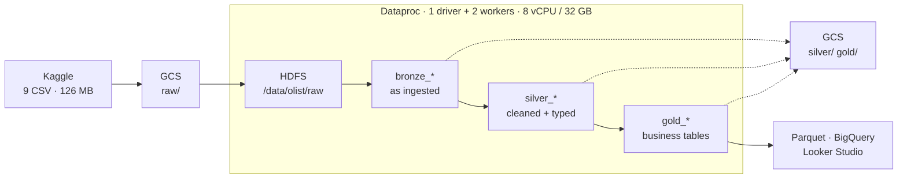
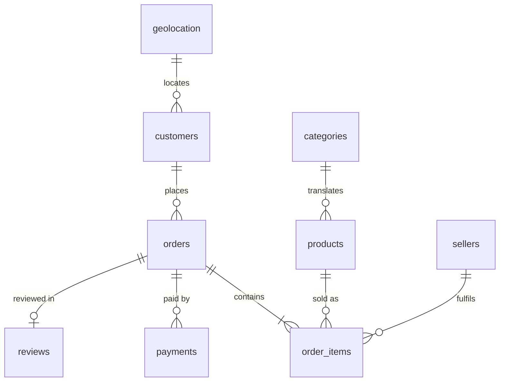
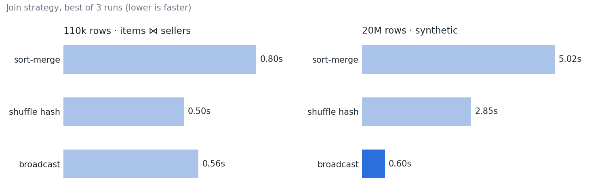

# Olist E-commerce Data Pipeline

Batch pipeline over the [Olist Brazilian e-commerce dataset](https://www.kaggle.com/datasets/olistbr/brazilian-ecommerce) — 9 related CSVs, ~1.4M rows — built with PySpark on a Google Cloud Dataproc cluster using a bronze / silver / gold layout on HDFS and Hive.

> **Status:** ingestion through optimization are done, with partitioned Parquet and CSV exports on GCS. A BigQuery + Looker Studio dashboard is the remaining piece; see [Progress](#progress).

## Architecture



Solid arrows are the processing path; dotted arrows are the durable copies. Every layer is written to Cloud Storage as well as HDFS, which makes the cluster disposable — it can be deleted and recreated from `infra/create_cluster.sh` in about three minutes without losing work.

## The data



`orders` is the hub and `order_items` sets the grain — one row per product per order, which is why it carries more rows than `orders` does. Column-level detail, including every derived field and the reasoning behind it, is in [`docs/data_dictionary.md`](docs/data_dictionary.md).

## Pipeline stages

| Notebook | Reads | Does | Writes |
|---|---|---|---|
| `01_ingestion` | CSV on HDFS | Loads 9 datasets, asserts row counts against the source | `bronze_*` |
| `02_exploration` | `bronze_*` | Null and duplicate profiling, business EDA, delivery-time analysis | nothing |
| `03_cleaning` | `bronze_*` | Null handling, type fixes, outlier trimming, geolocation collapse, feature engineering | `silver_*` |
| `04_integration` | `silver_*` | Pre-aggregates payments and reviews, joins all 8 datasets, aggregations, window functions, enrichment | `gold_*` |
| `05_optimization_serving` | `silver_*`, `gold_*` | Executor tuning, join-strategy benchmarks, bucketing, skew, caching, export | partitioned Parquet + CSV on GCS |

## Data quality findings

Every one of these produces **wrong numbers without raising an error** — the dangerous kind. Each was caught by comparing a row count or a total against something it should have matched, which is why those checks are built into the notebooks rather than done once by hand.

**Joining `payments` inflated revenue by about 5%.** `payments` holds 103,886 rows for 99,440 distinct orders, because an order can be split across a card and a voucher. Joined onto a table already at item grain, every item in such an order is duplicated once per payment method, and `sum(price)` then counts the same item twice. The fact table came out at 115,864 rows against 110,337 items. Pre-aggregated `payments` and `reviews` to one row per order before joining, and added an assertion that the joined table matches the item count exactly.

**Retention analysis returned a lifespan of zero for every customer.** The dataset carries both `customer_id`, which is issued fresh for each order, and `customer_unique_id`, which identifies the person. Grouping on `customer_id` puts exactly one order in each group, so first and last order dates are always the same date. Switched to `customer_unique_id`: 99,441 orders resolve to 93,642 people, and the top customer turns out to have ordered 16 times over 462 days.

**Order counts were counting items.** With the fact table at one row per product per order, `count("order_id")` returns the number of items, not orders — one customer appeared to have placed 63 orders when they had placed one order for 63 items. `countDistinct` throughout, and average order value computed as total spend over distinct orders rather than as a mean of item prices.

**`order_reviews` parsed 4,938 rows too many.** Spark read 104,162 rows against a documented 99,224. Review comments are free text containing newlines inside quoted fields, so the default CSV reader split single reviews across multiple rows. Left alone, every seller's average review score would have been wrong downstream. Fixed with `multiLine` and `escape`, and notebook 01 now asserts row counts against expected values so the pipeline stops rather than propagating bad data.

**`geolocation` is one-to-many with orders.** The table has 1,000,163 rows but only ~19,000 distinct zip prefixes. Joining it directly multiplies the fact table and inflates every revenue figure. Collapsed to one row per zip — averaging coordinates, taking the first city and state — before any join: **1,000,163 → 19,015**.

**The outlier filter was removing nothing.** `approxQuantile("price", [0.01, 0.99], 0.01)` returned bounds wide enough to span the entire range, because the third argument is a *relative error on the rank* — set to 0.01, it permits the 0.99 quantile to come back as the maximum. Row count after filtering was identical to before. Tightened to 0.001.

## Key decisions

**Dataproc image pinned to 2.2, not the 2.3 default.** Image 2.3 auto-loads a BigLake catalog extension that intercepts every catalog operation and fails unless the Lakehouse API is enabled. It cannot be turned off from the notebook — setting `spark.sql.extensions` on `SparkSession.builder` has no effect because the extension binds at cluster level.

**Dynamic allocation off for the benchmarks.** Dataproc turns it on by default, which lets Spark hand executors back while idle and request them again on the next job. Every first run would then include executor start-up time.

**Fixed 2 workers rather than autoscaling.** Notebook 05 measures join strategies against each other; a cluster that resizes mid-run makes those numbers meaningless. Dataproc's secondary workers are also preemptible by default and can vanish during a job.

**Join type chosen per table from business rules, not convenience.** Orders → items → products → sellers → customers are inner joins: an order missing any of those is unusable. Geolocation, reviews and payments are left joins, because most customers never leave a review and dropping those orders would silently shrink the dataset.

**`median` over `mean` for imputing payment values.** Payment amounts have a long right tail; the mean sits well above anything a typical customer pays.

**Every layer mirrored to Cloud Storage.** HDFS lives on the cluster's disks and dies with it. Writing each layer to `gs://` as well means the cluster can be stopped or deleted between sessions — which is what keeps the bill near zero.

**Row-count assertions between stages, not just at ingestion.** Three of the five findings above were silent inflations that a schema check would have passed. Ingestion asserts each dataset against its documented size; integration asserts that the joined fact table still matches the item count. Both stop the run rather than writing bad data forward.

## Gold tables

| Table | Rows | Grain |
|---|---|---|
| `gold_full_orders` | 110,337 | one row per product per order |
| `gold_customer_spending` | 93,642 | one row per person |
| `gold_customer_retention` | 93,642 | one row per person |
| `gold_product_metrics` | 31,931 | one row per product |
| `gold_seller_performance` | 3,028 | one row per seller |
| `gold_top_products_per_seller` | 16,631 | top 5 by price per seller, ties included |
| `gold_monthly_trend` | 24 | one row per month |

`full_orders` matching the 110,337 items exactly is the check that the join fan-out is gone. The two customer tables agreeing at 93,642 confirms both group on the person rather than the order.

## Performance



| What was measured | Result |
|---|---|
| Join strategy, 20M rows | broadcast **8.4×** faster than sort-merge (0.60 s vs 5.02 s) |
| Join strategy, real 110k rows | no meaningful difference — all within run-to-run noise |
| Bucketing `orders` ⋈ `order_items` | both `Exchange` nodes removed from the plan; 0.55 s → 0.40 s |
| Salting a 254× skewed key | no gain (0.48 s vs 0.52 s) — AQE has nothing to split below 256 MB |
| Caching `gold_full_orders` | 15% faster; 23.3 MiB, fully in memory |
| Partition pruning on GCS | one month read out of 24 (8,064 of 110,337 rows) |

Half of these are results where the optimisation *didn't* help, and the reason why is the useful part. Methodology, every run, and the physical plans behind each number are in [`docs/benchmarks.md`](docs/benchmarks.md). The tuning profile itself, with the reasoning for each value, is [`config/spark_tuning.py`](config/spark_tuning.py).

## Reproducing

```bash
# 1. one-time project setup, then create the cluster
bash infra/create_cluster.sh

# 2. download archive.zip from Kaggle, upload it to the bucket through the
#    Cloud Storage console, then from an SSH session on the master:
bash infra/load_data.sh

# 3. open JupyterLab from the cluster's Web Interfaces tab and run
#    notebooks 01 through 05 in order
```

Each notebook is self-contained: it builds its own `SparkSession` and reads its inputs from Hive, so any stage can be re-run on its own as long as the previous layer exists. Nothing is passed between notebooks in memory.

Open notebooks with the **Python 3** kernel, not PySpark. The PySpark kernel starts its own session before the first cell runs, `getOrCreate()` returns it, and every executor setting is silently ignored — including the HDFS warehouse path, which then fails on the first `CREATE DATABASE`. Each notebook asserts its app name to catch this.

Run one notebook at a time — the cluster has 8 vCPU total, and a second live `SparkSession` will sit waiting for resources that the first one holds.

## Cost

About **$0.45/hour** while running, on a $300 free-trial credit. The cluster deletes itself after 2 hours idle (`--max-idle=2h`), so nothing is billed between sessions; notebook 05 restores the silver and gold tables from GCS in about a minute on a fresh cluster.

An earlier version stopped the cluster instead of deleting it. A stopped cluster is pinned to its zone and machine type, and when that zone ran out of `n4d` capacity the cluster could not start for several days. Deleting and recreating avoids that lock-in. One open Jupyter kernel keeps the cluster from ever counting as idle — shut all kernels down at the end of a session.

## Layout

```
infra/
  create_cluster.sh     cluster spec with the reasoning behind each flag
  load_data.sh          Kaggle archive -> HDFS + GCS
notebooks/
  01_ingestion.ipynb
  02_exploration.ipynb
  03_cleaning.ipynb
  04_integration.ipynb
  05_optimization_serving.ipynb
config/
  spark_tuning.py       executor sizing, AQE, shuffle partitions + build_session()
docs/
  data_dictionary.md    every table and column, including derived fields
  benchmarks.md         every timing, run by run, with the plans behind them
  img/                  benchmark chart, Spark UI screenshot
```

## Stack

PySpark 3.5 · Hadoop 3.3 (HDFS, YARN) · Hive metastore · Parquet · Google Cloud Dataproc, Cloud Storage

## Progress

- [x] Cluster provisioning as a reproducible script
- [x] Kaggle archive into HDFS with replication, mirrored to GCS
- [x] Ingestion of all 9 datasets with row-count assertions
- [x] Null and duplicate profiling, business EDA, delivery-time distribution
- [x] Cleaning: nulls, types, outliers, geolocation collapse, feature engineering
- [x] Integration: 8-way join, aggregations, window functions, enrichment
- [x] Optimization: executor tuning, join benchmarks, bucketing, skew, caching
- [x] Serving: partitioned Parquet and CSV exports on GCS
- [ ] Serving: BigQuery load, Looker Studio dashboard
- [x] Docs: data dictionary and ERD
- [x] Docs: benchmark results
- [ ] Docs: dashboard screenshot
