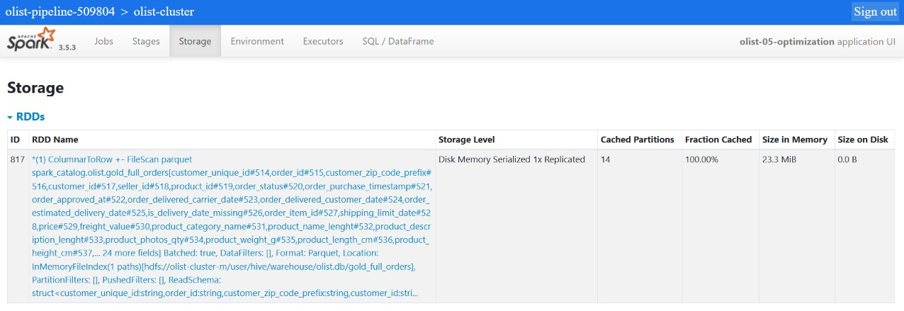

# Benchmarks

Everything in `notebooks/05_optimization_serving.ipynb`, measured on one cluster in one session.

## Setup

| | |
|---|---|
| Cluster | Dataproc 2.2 (Spark 3.5.3), 1 driver + 2 workers, `e2-standard-4` (4 vCPU / 16 GB) |
| Executors | 2 × 4 cores × 6 GB, fixed — `spark.dynamicAllocation.enabled=false` |
| Shuffle partitions | 64, AQE on |
| Method | each query run 3 times, best time reported, all three runs kept below |

Dynamic allocation is on by default on Dataproc. Left on, Spark releases idle executors and requests them again, so the first run of every benchmark includes waiting for executors to start.

Every join comparison sets `spark.sql.autoBroadcastJoinThreshold=-1` first. Otherwise Spark broadcasts any table under 20 MB on its own, and every strategy being compared turns into the same broadcast join.

## Join strategies on real data

`silver_order_items` (110,337 rows) ⋈ `silver_sellers` (3,095 rows) on `seller_id`.

| Strategy | Best | Runs |
|---|---:|---|
| sort-merge (default) | 0.80 s | 2.58, 1.52, 0.80 |
| broadcast | 0.56 s | 0.98, 0.56, 0.56 |
| shuffle hash | 0.50 s | 0.72, 0.50, 0.68 |
| merge hint | 0.46 s | 0.68, 0.56, 0.46 |

**At this size the strategy doesn't matter.** `merge` is the same plan as sort-merge and came out fastest, which puts every gap in this table inside run-to-run noise. A 110k × 3k join finishes in a fraction of a second whichever way it runs; what's being measured is mostly the fixed cost of scheduling a job.

## Join strategies at 20M rows

`spark.range(20_000_000)` with 3,000 distinct keys, joined to a 3,000-row table.

| Strategy | Best | Runs | vs sort-merge |
|---|---:|---|---:|
| sort-merge | 5.02 s | 6.18, 5.46, 5.02 | 1× |
| shuffle hash | 2.85 s | 4.04, 3.33, 2.85 | 1.8× |
| broadcast | 0.60 s | 0.93, 0.66, 0.60 | **8.4×** |

The physical plans explain the order. Sort-merge has an `Exchange` and a `Sort` on both sides — 20M rows move across the network and then get sorted. Shuffle hash keeps the `Exchange` but replaces the sort with a hash table built from the small side. Broadcast has no `Exchange` on the large side at all; only the 3,000-row table is shipped, to every executor.

## Bucketing

`orders` and `order_items` written with `repartition(16, "order_id")` then `bucketBy(16, "order_id").sortBy("order_id")`, giving one file per bucket. Sort-merge join on `order_id`.

| | Plain tables | Bucketed |
|---|---|---|
| Time | 0.55 s | 0.40 s |
| `Exchange` | 2 | **0** |
| `Sort` | 2 | 2 |
| Scan | — | `Bucketed: true, SelectedBucketsCount: 16 out of 16` |

The shuffle is paid once, at write time, and every later join on `order_id` skips it. The `Sort` nodes stay: since Spark 3.0 a bucketed scan does not report its output as sorted, so the planner sorts again regardless (`spark.sql.legacy.bucketedTableScan.outputOrdering=true` restores the old behaviour). The plan is the evidence here; at 110k rows the time saved is small.

With the broadcast threshold left at 20 MB, Spark broadcasts these tables and the scan shows `Bucketed: false (disabled by query planner)`. Bucketing only pays off when both sides are too large to broadcast.

## Skew and salting

Items per seller in `gold_full_orders`: max **2,033**, median **8**, mean 36.4. The largest seller holds 254× the median — real skew in shape.

| | Best | Runs |
|---|---:|---|
| sort-merge, AQE skew handling on | 0.48 s | 0.88, 0.48, 0.72 |
| sort-merge + 8-way salt | 0.52 s | 1.02, 0.52, 0.54 |

**Salting didn't help.** AQE only splits a partition that is over 256 MB *and* 5× the median partition; nothing in this dataset is close to 256 MB, so there is nothing to split. Salting adds cost — the seller table is replicated 8× and every row gets an extra column — without a hot partition to relieve. It is a tool for skewed keys measured in gigabytes, not row counts.

## Caching

Three aggregations over `gold_full_orders` (group by state, group by seller, filter on review score).

| | Best | Runs |
|---|---:|---|
| No cache | 0.76 s | 0.97, 0.76, 0.91 |
| `persist(MEMORY_AND_DISK)` | 0.65 s | 0.81, 0.65, 0.73 |

1.2× faster, 15% less time. The whole table fit in memory — 23.3 MiB across 14 partitions, nothing spilled to disk:

The gain is modest because the source is already columnar Parquet on HDFS, which is cheap to re-read. Caching earns more on a DataFrame that is expensive to recompute, such as a multi-way join reused several times.

## Partition pruning

`gold_full_orders` written to GCS with `partitionBy("order_year", "order_month")`. A filter on March 2018 shows up in the plan as `PartitionFilters: [... (order_year = 2018), (order_month = 3)]` — Spark lists only that one directory and reads 8,064 rows instead of 110,337.

## Machine type matters more than expected

The same notebook was first run on `n4d-standard-4` (AMD, same 4 vCPU / 16 GB) before that zone ran out of capacity. Sort-merge at 20M took 1.69 s there against 5.02 s on `e2-standard-4`; broadcast was 0.24 s against 0.60 s. Same vCPU count, same memory, same config — roughly 2.5–3× slower. Numbers from different machine families are not comparable, which is why every figure above comes from a single cluster.
