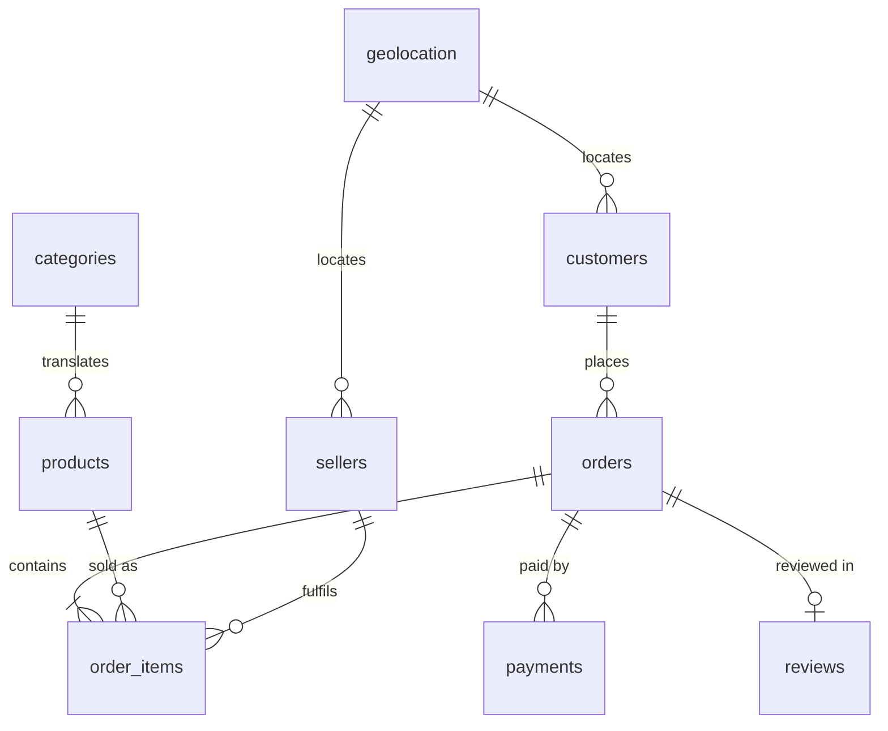

# Data dictionary

Nine source files from the [Olist Brazilian e-commerce dataset](https://www.kaggle.com/datasets/olistbr/brazilian-ecommerce), plus the columns this pipeline derives.

Row counts are asserted in `notebooks/01_ingestion.ipynb`; a mismatch stops the run.

---

## Entity relationships

`orders` is the hub. `order_items` is the grain of the fact table — one row per product per order, which is why it has more rows than `orders`.

---

## customers — 99,441 rows

One row per order, not per person.

| Column | Type | Notes |
|---|---|---|
| `customer_id` | string | Key used to join to `orders`. Unique per row. |
| `customer_unique_id` | string | The actual person. Repeats when someone orders more than once — use this for retention analysis, not `customer_id`. |
| `customer_zip_code_prefix` | int → **string** | Cast to string in silver: it is an identifier, not a quantity, and leading zeros are lost as an integer. |
| `customer_city` | string | |
| `customer_state` | string | Two-letter Brazilian state code. |

---

## orders — 99,441 rows

| Column | Type | Notes |
|---|---|---|
| `order_id` | string | Primary key. Verified unique. |
| `customer_id` | string | Joins to `customers`. |
| `order_status` | string | `delivered`, `shipped`, `canceled`, `unavailable`, `invoiced`, `processing`, `created`, `approved`. |
| `order_purchase_timestamp` | timestamp | When the order was placed. |
| `order_approved_at` | timestamp | Payment approval. Null for some orders. |
| `order_delivered_carrier_date` | timestamp | Handed to the carrier. |
| `order_delivered_customer_date` | timestamp | Received by the customer. **Null when not yet delivered or cancelled** — this is meaningful, not corrupt. |
| `order_estimated_delivery_date` | timestamp | The promise made at checkout. |

### Derived in silver

| Column | Notes |
|---|---|
| `is_delivery_date_missing` | Boolean flag set before the null is filled, so downstream can still tell real dates from the sentinel. |
| `delivery_days` | `datediff(delivered, purchased)`. Median 10, mean 12.5, max over 200 — the spread is a genuine logistics signal. |

`order_delivered_customer_date` nulls are filled with `9999-12-31` using `coalesce` and an explicit cast. `fillna` with a string silently does nothing on a timestamp column — it reports no error and changes no rows.

---

## order_items — 112,650 rows

One row per product per order. The grain of the fact table.

| Column | Type | Notes |
|---|---|---|
| `order_id` | string | Joins to `orders`. |
| `order_item_id` | int | Sequence within the order: 1, 2, 3… Not globally unique. |
| `product_id` | string | Joins to `products`. |
| `seller_id` | string | Joins to `sellers`. |
| `shipping_limit_date` | timestamp | Deadline for the seller to hand over the parcel. |
| `price` | double | Item price, excluding freight. |
| `freight_value` | double | Shipping charged for this item. |

Silver trims the top and bottom 1% of `price` using `approxQuantile` with a relative error of **0.001**. At the more permissive 0.01 the returned bounds span the entire range and the filter removes nothing.

---

## payments — 103,886 rows

More rows than orders: an order can be split across payment methods.

| Column | Type | Notes |
|---|---|---|
| `order_id` | string | Joins to `orders`. |
| `payment_sequential` | int | Counter when an order uses several payments. |
| `payment_type` | string | `credit_card`, `boleto`, `voucher`, `debit_card`, `not_defined`. |
| `payment_installments` | int | Instalments chosen at checkout. |
| `payment_value` | double | Amount for this payment line. |

### Derived in silver

| Column | Notes |
|---|---|
| `payment_value_imputed` | Nulls filled with the **median** via `pyspark.ml.feature.Imputer`. The mean is dragged well above a typical payment by a long right tail. |
| `payment_method` | Readable label. `boleto` becomes "Bank Slip" — a Brazilian payment voucher settled at a bank, meaningless to a reader who does not know the market. |

---

## reviews — 99,224 rows

| Column | Type | Notes |
|---|---|---|
| `review_id` | string | |
| `order_id` | string | Joins to `orders`. Most orders have no review, so this is a left join. |
| `review_score` | int | 1 to 5. |
| `review_comment_title` | string | Null for roughly 88% of reviews — most people rate without writing a headline. |
| `review_comment_message` | string | Free text. **Contains newlines inside quoted fields.** |
| `review_creation_date` | timestamp | |
| `review_answer_timestamp` | timestamp | |

Read with `multiLine` and `escape='"'`. Without them Spark treats the newlines inside comments as row separators and returns **104,162 rows instead of 99,224** — silently splitting single reviews across several rows and corrupting every average score computed downstream.

---

## products — 32,951 rows

| Column | Type | Notes |
|---|---|---|
| `product_id` | string | Primary key. |
| `product_category_name` | string | Portuguese. Joins to `categories`. |
| `product_name_lenght` | int | Misspelling is present in the source file — kept as-is so the raw layer stays faithful. |
| `product_description_lenght` | int | Same. |
| `product_photos_qty` | int | |
| `product_weight_g` | int | |
| `product_length_cm` | int | |
| `product_height_cm` | int | |
| `product_width_cm` | int | |

### Derived in silver

| Column | Notes |
|---|---|
| `product_size_category` | `small` under 500 g, `medium` under 2000 g, `large` above. Cascading `when` conditions evaluate top-down and stop at the first match. |
| `product_category_name_english` | Joined from `categories` with a broadcast hint — 71 rows is far below any shuffle threshold. |

---

## sellers — 3,095 rows

| Column | Type | Notes |
|---|---|---|
| `seller_id` | string | Primary key. |
| `seller_zip_code_prefix` | int | |
| `seller_city` | string | |
| `seller_state` | string | |

Small enough to broadcast in every join it participates in.

---

## geolocation — 1,000,163 rows → 19,015 after cleaning

| Column | Type | Notes |
|---|---|---|
| `geolocation_zip_code_prefix` | int | **Not unique** — around 19,000 distinct values across a million rows. |
| `geolocation_lat` | double | |
| `geolocation_lng` | double | |
| `geolocation_city` | string | |
| `geolocation_state` | string | |

Joining this table as-is multiplies the fact table and inflates every revenue figure, with no error raised. Silver collapses it to one row per zip prefix first: mean latitude and longitude, first city and state.

### Derived in silver

| Column | Notes |
|---|---|
| `geo_lat`, `geo_lng` | Centroid of the zip prefix. |
| `geo_city`, `geo_state` | First value in the group; rows sharing a prefix are almost always the same locality. |
| `customer_zip_code_prefix` | Renamed and cast to string so it joins to `customers` by column name. |

---

## categories — 71 rows

| Column | Type | Notes |
|---|---|---|
| `product_category_name` | string | Portuguese. |
| `product_category_name_english` | string | English label used in every report. |

The source course loads this file but never uses it, leaving reports in Portuguese.
